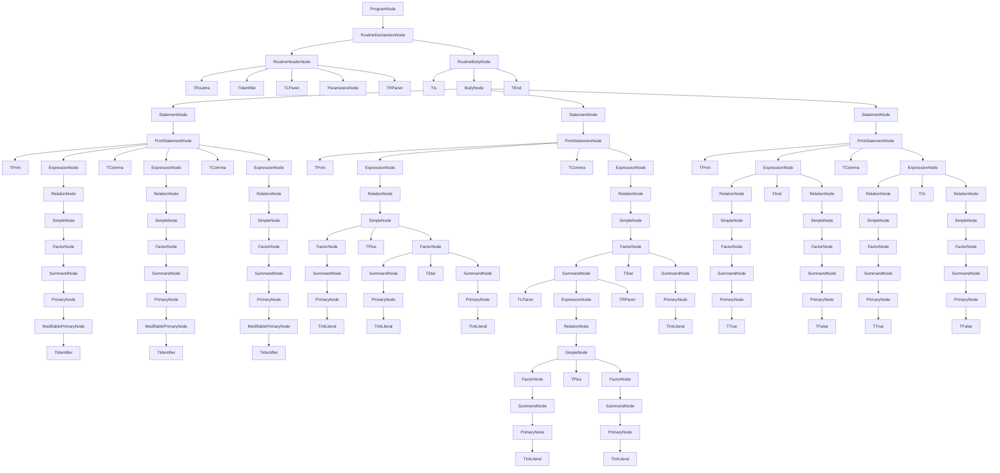

```mermaid
graph TD
   -191917335[ProgramNode] --> -191917366[RoutineDeclarationNode]
   -191917366[RoutineDeclarationNode] --> -2101051643[RoutineHeaderNode]
   -2101051643[RoutineHeaderNode] --> 1177763294[TRoutine]
   -2101051643[RoutineHeaderNode] --> 1689124693[TIdentifier]
   -2101051643[RoutineHeaderNode] --> -1013620382[TLParen]
   -2101051643[RoutineHeaderNode] --> 1[ParametersNode]
   -2101051643[RoutineHeaderNode] --> -1132219908[TRParen]
   -191917366[RoutineDeclarationNode] --> 516173166[RoutineBodyNode]
   516173166[RoutineBodyNode] --> -1727884534[TIs]
   516173166[RoutineBodyNode] --> 1588305656[BodyNode]
   1588305656[BodyNode] --> -713754528[StatementNode]
   -713754528[StatementNode] --> -713754559[PrintStatementNode]
   -713754559[PrintStatementNode] --> -998500107[TPrint]
   -713754559[PrintStatementNode] --> 1685810904[ExpressionNode]
   1685810904[ExpressionNode] --> 1685810873[RelationNode]
   1685810873[RelationNode] --> 1685810842[SimpleNode]
   1685810842[SimpleNode] --> 1685810811[FactorNode]
   1685810811[FactorNode] --> 1685810780[SummandNode]
   1685810780[SummandNode] --> 1685810749[PrimaryNode]
   1685810749[PrimaryNode] --> 1685810718[ModifiablePrimaryNode]
   1685810718[ModifiablePrimaryNode] --> 1685810687[TIdentifier]
   -713754559[PrintStatementNode] --> 2016713499[TComma]
   -713754559[PrintStatementNode] --> 1685813881[ExpressionNode]
   1685813881[ExpressionNode] --> 1685813850[RelationNode]
   1685813850[RelationNode] --> 1685813819[SimpleNode]
   1685813819[SimpleNode] --> 1685813788[FactorNode]
   1685813788[FactorNode] --> 1685813757[SummandNode]
   1685813757[SummandNode] --> 1685813726[PrimaryNode]
   1685813726[PrimaryNode] --> 1685813695[ModifiablePrimaryNode]
   1685813695[ModifiablePrimaryNode] --> 1685813664[TIdentifier]
   -713754559[PrintStatementNode] --> 2016716475[TComma]
   -713754559[PrintStatementNode] --> 1685816858[ExpressionNode]
   1685816858[ExpressionNode] --> 1685816827[RelationNode]
   1685816827[RelationNode] --> 1685816796[SimpleNode]
   1685816796[SimpleNode] --> 1685816765[FactorNode]
   1685816765[FactorNode] --> 1685816734[SummandNode]
   1685816734[SummandNode] --> 1685816703[PrimaryNode]
   1685816703[PrimaryNode] --> 1685816672[ModifiablePrimaryNode]
   1685816672[ModifiablePrimaryNode] --> 1685816641[TIdentifier]
   1588305656[BodyNode] --> 1856380563[StatementNode]
   1856380563[StatementNode] --> 1856380532[PrintStatementNode]
   1856380532[PrintStatementNode] --> -998470316[TPrint]
   1856380532[PrintStatementNode] --> -2127975325[ExpressionNode]
   -2127975325[ExpressionNode] --> -2127975356[RelationNode]
   -2127975356[RelationNode] --> -2127975387[SimpleNode]
   -2127975387[SimpleNode] --> -1377319889[FactorNode]
   -1377319889[FactorNode] --> -1377319920[SummandNode]
   -1377319920[SummandNode] --> -1377319951[PrimaryNode]
   -1377319951[PrimaryNode] --> -1377319982[TIntLiteral]
   -2127975387[SimpleNode] --> 949953983[TPlus]
   -2127975387[SimpleNode] --> -757321418[FactorNode]
   -757321418[FactorNode] --> -1377315951[SummandNode]
   -1377315951[SummandNode] --> -1377315982[PrimaryNode]
   -1377315982[PrimaryNode] --> -1377316013[TIntLiteral]
   -757321418[FactorNode] --> 182762252[TStar]
   -757321418[FactorNode] --> -1377311982[SummandNode]
   -1377311982[SummandNode] --> -1377312013[PrimaryNode]
   -1377312013[PrimaryNode] --> -1377312044[TIntLiteral]
   1856380532[PrintStatementNode] --> 2016751226[TComma]
   1856380532[PrintStatementNode] --> -1468742562[ExpressionNode]
   -1468742562[ExpressionNode] --> -1468742593[RelationNode]
   -1468742593[RelationNode] --> -1468742624[SimpleNode]
   -1468742624[SimpleNode] --> -1468742655[FactorNode]
   -1468742655[FactorNode] --> 878924060[SummandNode]
   878924060[SummandNode] --> -1013553856[TLParen]
   878924060[SummandNode] --> 1558818141[ExpressionNode]
   1558818141[ExpressionNode] --> 1558818110[RelationNode]
   1558818110[RelationNode] --> 1558818079[SimpleNode]
   1558818079[SimpleNode] --> -1377307985[FactorNode]
   -1377307985[FactorNode] --> -1377308016[SummandNode]
   -1377308016[SummandNode] --> -1377308047[PrimaryNode]
   -1377308047[PrimaryNode] --> -1377308078[TIntLiteral]
   1558818079[SimpleNode] --> 949965887[TPlus]
   1558818079[SimpleNode] --> -1377304016[FactorNode]
   -1377304016[FactorNode] --> -1377304047[SummandNode]
   -1377304047[SummandNode] --> -1377304078[PrimaryNode]
   -1377304078[PrimaryNode] --> -1377304109[TIntLiteral]
   878924060[SummandNode] --> -1132148422[TRParen]
   -1468742655[FactorNode] --> 182775148[TStar]
   -1468742655[FactorNode] --> -1377299086[SummandNode]
   -1377299086[SummandNode] --> -1377299117[PrimaryNode]
   -1377299117[PrimaryNode] --> -1377299148[TIntLiteral]
   1588305656[BodyNode] --> -1401612692[StatementNode]
   -1401612692[StatementNode] --> -1401612723[PrintStatementNode]
   -1401612723[PrintStatementNode] --> -998440525[TPrint]
   -1401612723[PrintStatementNode] --> 478283661[ExpressionNode]
   478283661[ExpressionNode] --> 603366690[RelationNode]
   603366690[RelationNode] --> 603366659[SimpleNode]
   603366659[SimpleNode] --> 603366628[FactorNode]
   603366628[FactorNode] --> 603366597[SummandNode]
   603366597[SummandNode] --> 603366566[PrimaryNode]
   603366566[PrimaryNode] --> 603366535[TTrue]
   478283661[ExpressionNode] --> -1470836124[TAnd]
   478283661[ExpressionNode] --> -1185270672[RelationNode]
   -1185270672[RelationNode] --> -1185270703[SimpleNode]
   -1185270703[SimpleNode] --> -1185270734[FactorNode]
   -1185270734[FactorNode] --> -1185270765[SummandNode]
   -1185270765[SummandNode] --> -1185270796[PrimaryNode]
   -1185270796[PrimaryNode] --> -1185270827[TFalse]
   -1401612723[PrintStatementNode] --> 2016785977[TComma]
   -1401612723[PrintStatementNode] --> -1969301461[ExpressionNode]
   -1969301461[ExpressionNode] --> 603382562[RelationNode]
   603382562[RelationNode] --> 603382531[SimpleNode]
   603382531[SimpleNode] --> 603382500[FactorNode]
   603382500[FactorNode] --> 603382469[SummandNode]
   603382469[SummandNode] --> 603382438[PrimaryNode]
   603382438[PrimaryNode] --> 603382407[TTrue]
   -1969301461[ExpressionNode] --> -718999002[TOr]
   -1969301461[ExpressionNode] --> -1185255792[RelationNode]
   -1185255792[RelationNode] --> -1185255823[SimpleNode]
   -1185255823[SimpleNode] --> -1185255854[FactorNode]
   -1185255854[FactorNode] --> -1185255885[SummandNode]
   -1185255885[SummandNode] --> -1185255916[PrimaryNode]
   -1185255916[PrimaryNode] --> -1185255947[TFalse]
   516173166[RoutineBodyNode] --> 1162969213[TEnd]
```