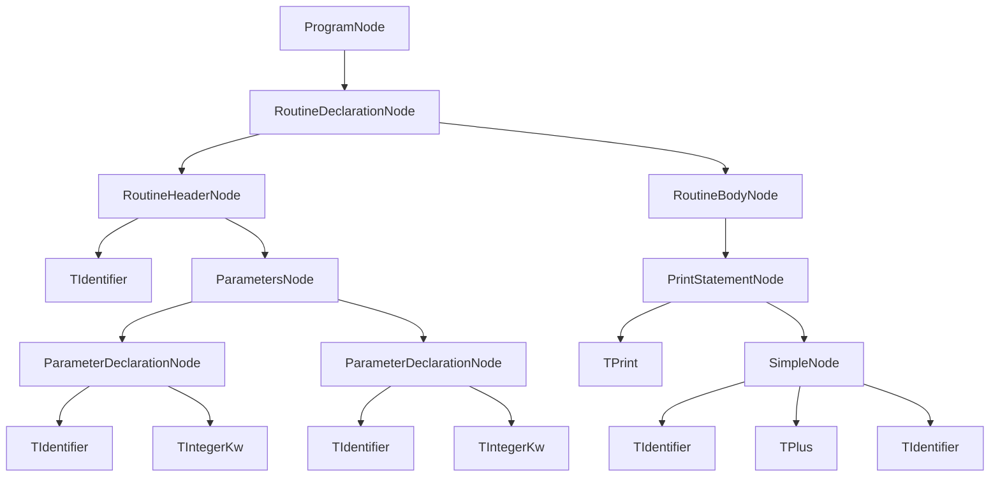

```mermaid
graph TD
   1792856208[ProgramNode] --> 1792856177[RoutineDeclarationNode]
   1792856177[RoutineDeclarationNode] --> 629737433[RoutineHeaderNode]
   629737433[RoutineHeaderNode] --> 1347405022[TIdentifier]
   629737433[RoutineHeaderNode] --> 1088386904[ParametersNode]
   1088386904[ParametersNode] --> 1350368586[ParameterDeclarationNode]
   1350368586[ParameterDeclarationNode] --> 1344066185[TIdentifier]
   1350368586[ParameterDeclarationNode] --> -1069923834[TIntegerKw]
   1088386904[ParametersNode] --> 1362190219[ParameterDeclarationNode]
   1362190219[ParameterDeclarationNode] --> 1344078090[TIdentifier]
   1362190219[ParameterDeclarationNode] --> -1069911930[TIntegerKw]
   1792856177[RoutineDeclarationNode] --> -549136023[RoutineBodyNode]
   -549136023[RoutineBodyNode] --> 1020650874[PrintStatementNode]
   1020650874[PrintStatementNode] --> -915966809[TPrint]
   1020650874[PrintStatementNode] --> -649150142[SimpleNode]
   -649150142[SimpleNode] --> 1344093000[TIdentifier]
   -649150142[SimpleNode] --> -2106649114[TPlus]
   -649150142[SimpleNode] --> 1344096969[TIdentifier]
```