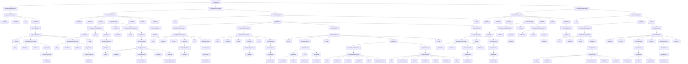

```mermaid
graph TD
   611165476[ProgramNode] --> -1921715886[SimpleDeclarationNode]
   -1921715886[SimpleDeclarationNode] --> -1921715917[TypeDeclarationNode]
   -1921715917[TypeDeclarationNode] --> -725999989[TTypeKw]
   -1921715917[TypeDeclarationNode] --> 2065625601[TIdentifier]
   -1921715917[TypeDeclarationNode] --> -283770975[TIs]
   -1921715917[TypeDeclarationNode] --> 598351325[TypeNode]
   598351325[TypeNode] --> 598351294[UserTypeNode]
   598351294[UserTypeNode] --> 598351263[RecordTypeNode]
   598351263[RecordTypeNode] --> 1857499068[TRecord]
   598351263[RecordTypeNode] --> 2132254559[VariableDeclarationNode]
   2132254559[VariableDeclarationNode] --> 1570614618[TVar]
   2132254559[VariableDeclarationNode] --> 1988365452[TIdentifier]
   2132254559[VariableDeclarationNode] --> -1225642206[TColon]
   2132254559[VariableDeclarationNode] --> 1106418894[TypeNode]
   1106418894[TypeNode] --> 1106418863[PrimitiveTypeNode]
   1106418863[PrimitiveTypeNode] --> 1106418832[TRealKw]
   598351263[RecordTypeNode] --> -1245625632[VariableDeclarationNode]
   -1245625632[VariableDeclarationNode] --> 1570644409[TVar]
   -1245625632[VariableDeclarationNode] --> 1988395244[TIdentifier]
   -1245625632[VariableDeclarationNode] --> -1225612415[TColon]
   -1245625632[VariableDeclarationNode] --> 1106448685[TypeNode]
   1106448685[TypeNode] --> 1106448654[PrimitiveTypeNode]
   1106448654[PrimitiveTypeNode] --> 1106448623[TRealKw]
   598351263[RecordTypeNode] --> -236207461[TEnd]
   611165476[ProgramNode] --> 816823267[RoutineDeclarationNode]
   816823267[RoutineDeclarationNode] --> -544678690[RoutineHeaderNode]
   -544678690[RoutineHeaderNode] --> 2084602824[TRoutine]
   -544678690[RoutineHeaderNode] --> -216181178[TIdentifier]
   -544678690[RoutineHeaderNode] --> 1824470625[TLParen]
   -544678690[RoutineHeaderNode] --> -132808396[ParametersNode]
   -132808396[ParametersNode] --> 1454141980[ParameterDeclarationNode]
   1454141980[ParameterDeclarationNode] --> 1988495505[TIdentifier]
   1454141980[ParameterDeclarationNode] --> -1225512130[TColon]
   1454141980[ParameterDeclarationNode] --> 1106548970[TypeNode]
   1106548970[TypeNode] --> 1106548939[PrimitiveTypeNode]
   1106548939[PrimitiveTypeNode] --> 1106548908[TRealKw]
   -132808396[ParametersNode] --> -1609112822[TComma]
   -132808396[ParametersNode] --> 938947459[ParameterDeclarationNode]
   938947459[ParameterDeclarationNode] --> 1992042637[TIdentifier]
   938947459[ParameterDeclarationNode] --> -1225500226[TColon]
   938947459[ParameterDeclarationNode] --> 1477158869[TypeNode]
   1477158869[TypeNode] --> 1477158838[UserTypeNode]
   1477158838[UserTypeNode] --> 1477158807[ArrayTypeNode]
   1477158807[ArrayTypeNode] --> -1177397657[TArray]
   1477158807[ArrayTypeNode] --> -1079554627[TLBracket]
   1477158807[ArrayTypeNode] --> 1280799001[ExpressionNode]
   1280799001[ExpressionNode] --> 1280798970[RelationNode]
   1477158807[ArrayTypeNode] --> -926839595[TRBracket]
   1477158807[ArrayTypeNode] --> 1106569802[TypeNode]
   1106569802[TypeNode] --> 1106569771[PrimitiveTypeNode]
   -544678690[RoutineHeaderNode] --> 689041444[TRParen]
   -544678690[RoutineHeaderNode] --> -1225484354[TColon]
   -544678690[RoutineHeaderNode] --> 1106576746[TypeNode]
   1106576746[TypeNode] --> 1106576715[PrimitiveTypeNode]
   1106576715[PrimitiveTypeNode] --> 1106576684[TRealKw]
   816823267[RoutineDeclarationNode] --> 521992512[RoutineBodyNode]
   521992512[RoutineBodyNode] --> -283578372[TIs]
   521992512[RoutineBodyNode] --> -467298072[BodyNode]
   -467298072[BodyNode] --> 1543301447[SimpleDeclarationNode]
   1543301447[SimpleDeclarationNode] --> 1543301416[VariableDeclarationNode]
   1543301416[VariableDeclarationNode] --> 1570763573[TVar]
   1543301416[VariableDeclarationNode] --> 1988621697[TIdentifier]
   1543301416[VariableDeclarationNode] --> -1225490275[TColon]
   1543301416[VariableDeclarationNode] --> 1106570825[TypeNode]
   1106570825[TypeNode] --> 1106570794[PrimitiveTypeNode]
   1106570794[PrimitiveTypeNode] --> 1106570763[TRealKw]
   1543301416[VariableDeclarationNode] --> -283584293[TIs]
   1543301416[VariableDeclarationNode] --> 992934442[ExpressionNode]
   992934442[ExpressionNode] --> 992934411[RelationNode]
   992934411[RelationNode] --> 992934380[SimpleNode]
   992934380[SimpleNode] --> 992934349[FactorNode]
   -467298072[BodyNode] --> -786241254[SimpleDeclarationNode]
   -786241254[SimpleDeclarationNode] --> -786241285[VariableDeclarationNode]
   -786241285[VariableDeclarationNode] --> 1570793364[TVar]
   -786241285[VariableDeclarationNode] --> 1991746637[TIdentifier]
   -786241285[VariableDeclarationNode] --> -1225459492[TColon]
   -786241285[VariableDeclarationNode] --> 1106601608[TypeNode]
   1106601608[TypeNode] --> 1106601577[PrimitiveTypeNode]
   1106601577[PrimitiveTypeNode] --> 1106601546[TRealKw]
   -786241285[VariableDeclarationNode] --> -283553510[TIs]
   -786241285[VariableDeclarationNode] --> -206437713[ExpressionNode]
   -206437713[ExpressionNode] --> -206437744[RelationNode]
   -206437744[RelationNode] --> -206437775[SimpleNode]
   -206437775[SimpleNode] --> -206437806[FactorNode]
   -467298072[BodyNode] --> 1574729783[StatementNode]
   1574729783[StatementNode] --> 1574729752[WhileLoopNode]
   1574729752[WhileLoopNode] --> 1133613462[TWhile]
   1574729752[WhileLoopNode] --> -621566757[ExpressionNode]
   -621566757[ExpressionNode] --> -621566788[RelationNode]
   -621566788[RelationNode] --> -1223183877[SimpleNode]
   -1223183877[SimpleNode] --> 1988683387[FactorNode]
   -1223183877[SimpleNode] --> 1318360715[TPlus]
   -1223183877[SimpleNode] --> 992988940[FactorNode]
   -621566788[RelationNode] --> 1396449029[TLt]
   -621566788[RelationNode] --> 1991790471[SimpleNode]
   1991790471[SimpleNode] --> 1991790440[FactorNode]
   1574729752[WhileLoopNode] --> -1036371141[TLoop]
   1574729752[WhileLoopNode] --> -337781524[BodyNode]
   -337781524[BodyNode] --> 741831895[SimpleDeclarationNode]
   741831895[SimpleDeclarationNode] --> 741831864[VariableDeclarationNode]
   741831864[VariableDeclarationNode] --> 1570856914[TVar]
   741831864[VariableDeclarationNode] --> 1988715794[TIdentifier]
   741831864[VariableDeclarationNode] --> -1225396934[TColon]
   741831864[VariableDeclarationNode] --> 1106664166[TypeNode]
   741831864[VariableDeclarationNode] --> -283490952[TIs]
   741831864[VariableDeclarationNode] --> -192018813[ExpressionNode]
   -337781524[BodyNode] --> -1859734750[StatementNode]
   -1859734750[StatementNode] --> -1859734781[IfStatementNode]
   -1859734781[IfStatementNode] --> -615057066[TIf]
   -1859734781[IfStatementNode] --> -594339490[ExpressionNode]
   -1859734781[IfStatementNode] --> 1155945560[TThen]
   -1859734781[IfStatementNode] --> -667747668[BodyNode]
   -1859734781[IfStatementNode] --> -146366009[TElse]
   -1859734781[IfStatementNode] --> -1929080105[BodyNode]
   -1859734781[IfStatementNode] --> -235871824[TEnd]
   1574729752[WhileLoopNode] --> -235846001[TEnd]
   -467298072[BodyNode] --> -1245107509[StatementNode]
   -1245107509[StatementNode] --> -1245107540[AssignmentNode]
   -1245107540[AssignmentNode] --> -103448755[ModifiablePrimaryNode]
   -103448755[ModifiablePrimaryNode] --> 1992346530[TIdentifier]
   -103448755[ModifiablePrimaryNode] --> -1079257678[TLBracket]
   -103448755[ModifiablePrimaryNode] --> 1281095950[ExpressionNode]
   1281095950[ExpressionNode] --> 1281095919[RelationNode]
   1281095919[RelationNode] --> 1281095888[SimpleNode]
   -103448755[ModifiablePrimaryNode] --> -926542646[TRBracket]
   -1245107540[AssignmentNode] --> -1885117200[TAssign]
   -1245107540[AssignmentNode] --> 1988926768[ExpressionNode]
   1988926768[ExpressionNode] --> 1988926737[RelationNode]
   1988926737[RelationNode] --> 1988926706[SimpleNode]
   1988926706[SimpleNode] --> 1988926675[FactorNode]
   521992512[RoutineBodyNode] --> -235790387[TEnd]
   611165476[ProgramNode] --> 992447350[RoutineDeclarationNode]
   992447350[RoutineDeclarationNode] --> -1061583031[RoutineHeaderNode]
   -1061583031[RoutineHeaderNode] --> 2085019898[TRoutine]
   -1061583031[RoutineHeaderNode] --> 1481288101[TIdentifier]
   -1061583031[RoutineHeaderNode] --> 1824894643[TLParen]
   -1061583031[RoutineHeaderNode] --> 32435552[ParametersNode]
   32435552[ParametersNode] --> -1457180962[ParameterDeclarationNode]
   -1457180962[ParameterDeclarationNode] --> 1988922978[TIdentifier]
   -1457180962[ParameterDeclarationNode] --> -1225087120[TColon]
   -1457180962[ParameterDeclarationNode] --> 2066216461[TypeNode]
   2066216461[TypeNode] --> 2066216430[TIdentifier]
   32435552[ParametersNode] --> -1608686820[TComma]
   32435552[ParametersNode] --> -1446344385[ParameterDeclarationNode]
   -1446344385[ParameterDeclarationNode] --> 1988933891[TIdentifier]
   -1446344385[ParameterDeclarationNode] --> -1225076208[TColon]
   -1446344385[ParameterDeclarationNode] --> 2066227373[TypeNode]
   2066227373[TypeNode] --> 2066227342[TIdentifier]
   -1061583031[RoutineHeaderNode] --> 689457526[TRParen]
   -1061583031[RoutineHeaderNode] --> -1225068272[TColon]
   -1061583031[RoutineHeaderNode] --> 1106992828[TypeNode]
   1106992828[TypeNode] --> 1106992797[PrimitiveTypeNode]
   1106992797[PrimitiveTypeNode] --> 1106992766[TRealKw]
   992447350[RoutineDeclarationNode] --> -458218018[RoutineBodyNode]
   -458218018[RoutineBodyNode] --> -283162290[TIs]
   -458218018[RoutineBodyNode] --> 42368215[BodyNode]
   42368215[BodyNode] --> -1975015762[SimpleDeclarationNode]
   -1975015762[SimpleDeclarationNode] --> -1975015793[VariableDeclarationNode]
   -1975015793[VariableDeclarationNode] --> 1571180647[TVar]
   -1975015793[VariableDeclarationNode] --> 1992469662[TIdentifier]
   -1975015793[VariableDeclarationNode] --> -1225072209[TColon]
   -1975015793[VariableDeclarationNode] --> 1944566662[TypeNode]
   1944566662[TypeNode] --> 1944566631[UserTypeNode]
   1944566631[UserTypeNode] --> 1944566600[ArrayTypeNode]
   1944566600[ArrayTypeNode] --> -1176969640[TArray]
   1944566600[ArrayTypeNode] --> -1079125618[TLBracket]
   1944566600[ArrayTypeNode] --> 1281228010[ExpressionNode]
   1944566600[ArrayTypeNode] --> -926410586[TRBracket]
   1944566600[ArrayTypeNode] --> 1106998811[TypeNode]
   42368215[BodyNode] --> 1138313732[StatementNode]
   1138313732[StatementNode] --> 1138313701[RoutineCallNode]
   1138313701[RoutineCallNode] --> -215708490[TIdentifier]
   1138313701[RoutineCallNode] --> 1824943313[TLParen]
   1138313701[RoutineCallNode] --> 1688280047[ExpressionNode]
   1688280047[ExpressionNode] --> 1688280016[RelationNode]
   1688280016[RelationNode] --> 1688279985[SimpleNode]
   1688279985[SimpleNode] --> 2109515274[FactorNode]
   1688279985[SimpleNode] --> 1318778750[TPlus]
   1688279985[SimpleNode] --> -558799994[FactorNode]
   1138313701[RoutineCallNode] --> -1608586566[TComma]
   1138313701[RoutineCallNode] --> 1992569110[ExpressionNode]
   1992569110[ExpressionNode] --> 1992569079[RelationNode]
   1992569079[RelationNode] --> 1992569048[SimpleNode]
   1992569048[SimpleNode] --> 1992569017[FactorNode]
   1138313701[RoutineCallNode] --> 689552820[TRParen]
   -458218018[RoutineBodyNode] --> -235641432[TEnd]
```