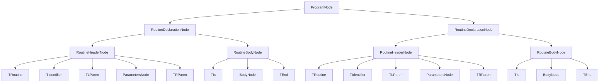

```mermaid
graph TD
   1921589113[ProgramNode] --> -619008393[RoutineDeclarationNode]
   -619008393[RoutineDeclarationNode] --> -2025109208[RoutineHeaderNode]
   -2025109208[RoutineHeaderNode] --> 1527546949[TRoutine]
   -2025109208[RoutineHeaderNode] --> 1736818925[TIdentifier]
   -2025109208[RoutineHeaderNode] --> -1045470021[TLParen]
   -2025109208[RoutineHeaderNode] --> -440783351[ParametersNode]
   -2025109208[RoutineHeaderNode] --> 1570563519[TRParen]
   -619008393[RoutineDeclarationNode] --> 2029833950[RoutineBodyNode]
   2029833950[RoutineBodyNode] --> -1388926109[TIs]
   2029833950[RoutineBodyNode] --> -2066818355[BodyNode]
   2029833950[RoutineBodyNode] --> 699825417[TEnd]
   1921589113[ProgramNode] --> -363988145[RoutineDeclarationNode]
   -363988145[RoutineDeclarationNode] --> 1022936909[RoutineHeaderNode]
   1022936909[RoutineHeaderNode] --> 1528530052[TRoutine]
   1022936909[RoutineHeaderNode] --> -761594126[TIdentifier]
   1022936909[RoutineHeaderNode] --> -1044477990[TLParen]
   1022936909[RoutineHeaderNode] --> -893343972[ParametersNode]
   1022936909[RoutineHeaderNode] --> 1571541662[TRParen]
   -363988145[RoutineDeclarationNode] --> -2010262213[RoutineBodyNode]
   -2010262213[RoutineBodyNode] --> -1387947966[TIs]
   -2010262213[RoutineBodyNode] --> -426359802[BodyNode]
   -2010262213[RoutineBodyNode] --> 700093536[TEnd]
```