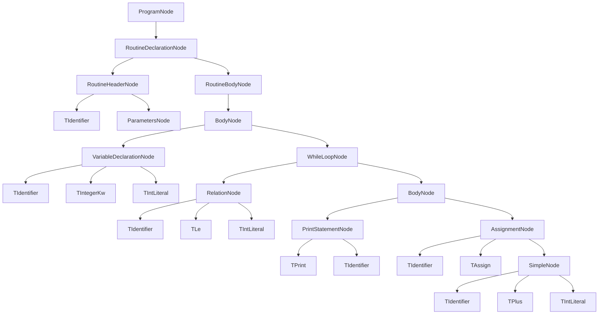

```mermaid
graph TD
   -1483151810[ProgramNode] --> -1483151841[RoutineDeclarationNode]
   -1483151841[RoutineDeclarationNode] --> -1826179864[RoutineHeaderNode]
   -1826179864[RoutineHeaderNode] --> 1873580932[TIdentifier]
   -1826179864[RoutineHeaderNode] --> 1[ParametersNode]
   -1483151841[RoutineDeclarationNode] --> -706151866[RoutineBodyNode]
   -706151866[RoutineBodyNode] --> -1923797590[BodyNode]
   -1923797590[BodyNode] --> -1050907766[VariableDeclarationNode]
   -1050907766[VariableDeclarationNode] --> -1466869629[TIdentifier]
   -1050907766[VariableDeclarationNode] --> -12928130[TIntegerKw]
   -1050907766[VariableDeclarationNode] --> -774246545[TIntLiteral]
   -1923797590[BodyNode] --> 589570131[WhileLoopNode]
   589570131[WhileLoopNode] --> 922987887[RelationNode]
   922987887[RelationNode] --> -1466808063[TIdentifier]
   922987887[RelationNode] --> 775003737[TLe]
   922987887[RelationNode] --> -774194895[TIntLiteral]
   589570131[WhileLoopNode] --> 1567840132[BodyNode]
   1567840132[BodyNode] --> 1760845867[PrintStatementNode]
   1760845867[PrintStatementNode] --> 1489590063[TPrint]
   1760845867[PrintStatementNode] --> -1466774304[TIdentifier]
   1567840132[BodyNode] --> -1478776146[AssignmentNode]
   -1478776146[AssignmentNode] --> -1466750465[TIdentifier]
   -1478776146[AssignmentNode] --> -1222045438[TAssign]
   -1478776146[AssignmentNode] --> -1452209099[SimpleNode]
   -1452209099[SimpleNode] --> -1466739553[TIdentifier]
   -1452209099[SimpleNode] --> 142070125[TPlus]
   -1452209099[SimpleNode] --> -774127381[TIntLiteral]
```